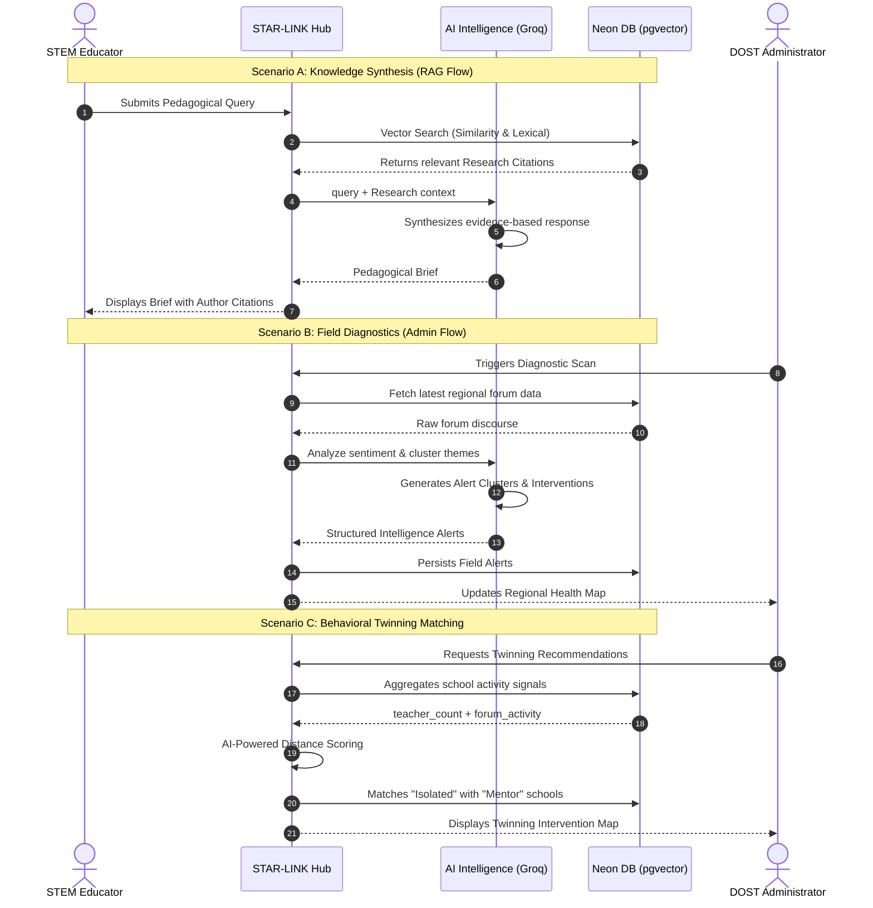
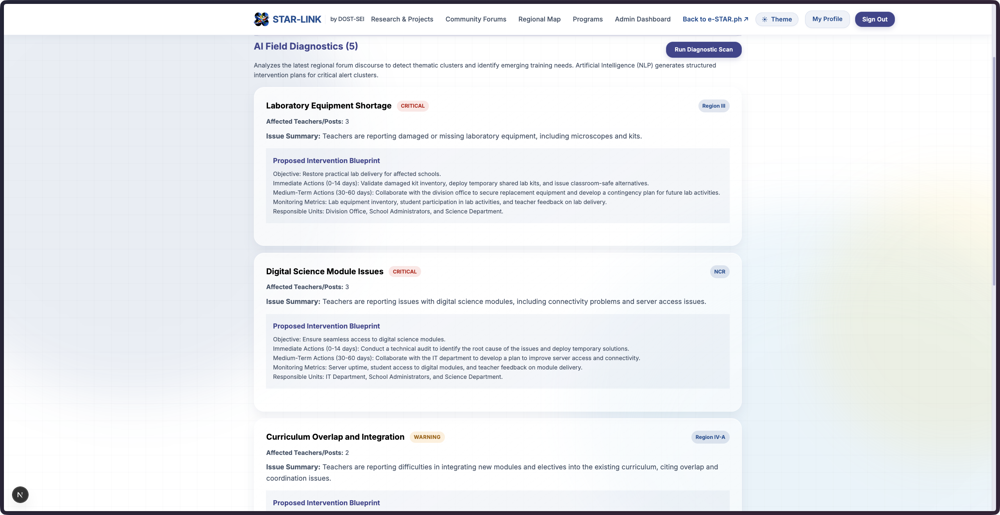

<div align="center">
  

  # STAR-LINK

  **Community Collaboration Hub for STEM Educators**

  
  
  
  
  
  
</div>

**Live Demo:** [https://geminated-star-link.vercel.app/](https://geminated-star-link.vercel.app/)

---

## Table of Contents

1. [Overview](#overview)
2. [Tech Stack](#tech-stack)
3. [Interactive Intelligence Flow](#interactive-intelligence-flow)
4. [Repository Structure](#repository-structure)
5. [Core Features](#core-features)
6. [Screenshots](#screenshots)
7. [Getting Started](#getting-started)
8. [Environment Variables](#environment-variables)
9. [Available Scripts](#available-scripts)
10. [UI/UX Design Direction](#uiux-design-direction)
11. [Security Hardening](#security-hardening)
12. [Production Readiness](#production-readiness)
13. [Success Metrics](#success-metrics)
14. [Delivery Phases](#delivery-phases)
15. [Team](#team)

---

## Overview

STAR-LINK is a community-driven collaboration hub designed to complement and enrich the e-STAR.ph platform. While e-STAR.ph serves as a static repository of lesson exemplars and training materials, STAR-LINK adds a dynamic social layer where educators can:

- Share action research and extension projects
- Discuss implementation challenges with peers
- Build mentorship and cross-school support networks

The goal is to transform isolated innovations into nationally shared assets for continuous STEM education improvement.

**Primary outcomes:**
- Increase educator participation in knowledge-sharing
- Support region-specific problem solving
- Provide evidence-based insights for STAR program planning

---

## Tech Stack

### Core Framework

| Layer | Technology | Version | Purpose |
|:------|:-----------|:--------|:--------|
| Framework |  | 16.2 | Server-side rendering, routing, API routes |
| UI Library |  | 19.2 | Component-based user interface |
| Language |  | 5.x | Static type safety across the codebase |
| Styling |  | -- | Scoped component styles with shared design tokens |

### Data and Authentication

| Layer | Technology | Version | Purpose |
|:------|:-----------|:--------|:--------|
| Database |  | -- | Serverless managed relational data store |
| Query Layer |  | 0.45 | Type-safe SQL queries and schema management |
| Database Driver |  | 1.x | HTTP-based PostgreSQL driver for edge/serverless |
| Schema Tooling |  | 0.31 | Migration generation and schema push |
| Authentication |  | -- | Server actions with bcryptjs password hashing |
| Auth Integration |  | 5.0-beta | Available for OAuth/social login expansion |

### Maps, Visualization, and Reporting

| Layer | Technology | Version | Purpose |
|:------|:-----------|:--------|:--------|
| Maps |  | 1.9 / 5.0 | Interactive geospatial map and collaboration overlays |
| Charts |  | 3.8 | Admin dashboard analytics visualizations |
| PDF Export |  | 4.2 / 5.0 | Server-side and client-side report generation |
| Geospatial Data |  | -- | Regional boundary rendering on the collaboration map |

### File Storage

| Layer | Technology | Version | Purpose |
|:------|:-----------|:--------|:--------|
| Document Storage |  | -- | Binary document storage for current uploads |
| Blob Storage |  | 2.3 | Available for large file offloading |

### Tooling and Quality

| Layer | Technology | Version | Purpose |
|:------|:-----------|:--------|:--------|
| CI Pipeline | NPM | -- | Lint, typecheck, and build in a single command |

### Knowledge Intelligence (AI Layer)

| Layer | Technology | Model | Purpose |
|:------|:-----------|:------|:--------|
| Inference Engine |  | Llama-3.1 / 3.3 | High-velocity LLM inference for RAG and NLP |
| Synthesis Layer |  | Custom | Context-grounded pedagogical answer synthesis |
| Analysis Layer |  | Custom | Thematic clustering of regional forum discourse |
| Embedding Fallback |  | Heuristic | Rule-based fallback for high-availability diagnostics |


---

## Interactive Intelligence Flow



---


## Repository Structure

```
Geminated/
├── public/
│   ├── data/
│   │   └── philippines-adm1.geojson    # Regional boundary data for collaboration map
│   └── img/
│       ├── favicon.png                 # Application favicon and branding mark
│       └── *.jpeg / *.jpg / *.png      # Team member and profile images
│
├── scripts/
│   └── seed-neon.mjs                   # Database seed script for Neon Postgres
│
├── src/
│   ├── app/
│   │   ├── layout.tsx                  # Root layout with navigation and theme
│   │   ├── page.tsx                    # Landing page
│   │   ├── globals.css                 # Global styles and design tokens
│   │   ├── loading.tsx                 # App-wide loading skeleton
│   │   │
│   │   ├── actions/                    # Server actions
│   │   │   ├── auth.ts                 # Authentication (login, register, logout)
│   │   │   ├── community.ts           # Forum posts, replies, moderation
│   │   │   ├── bulk-import.ts          # CSV/bulk data import processing
│   │   │   ├── feedback.ts            # Program feedback submission
│   │   │   ├── notifications.ts       # User notification management
│   │   │   ├── program-delivery.ts    # Program delivery tracking
│   │   │   └── training.ts            # Training record management
│   │   │
│   │   ├── admin/                      # Admin dashboard and management
│   │   │   ├── page.tsx               # Main admin panel (analytics, moderation)
│   │   │   ├── BulkImportTabContent.tsx
│   │   │   ├── DeliveryTabContent.tsx
│   │   │   └── regions/              # Region-specific admin views
│   │   │
│   │   ├── api/                        # API route handlers
│   │   │   ├── health/               # Health probe endpoint
│   │   │   ├── documents/            # Document download endpoint
│   │   │   ├── map/                  # Map data API
│   │   │   └── admin/
│   │   │       ├── reports/          # PDF report generation
│   │   │       └── bulk-import-template/
│   │   │
│   │   ├── forum/                      # Regional discussion forums
│   │   ├── hub/                        # Community resource hub
│   │   ├── login/                      # Authentication - sign in
│   │   ├── register/                   # Authentication - registration
│   │   ├── map/                        # Collaboration map view
│   │   ├── profile/                    # Teacher profile management
│   │   ├── programs/                   # STAR program listings
│   │   ├── repository/                 # Action research and extension repository
│   │   └── terms/                      # Terms of service
│   │
│   ├── components/                     # Shared UI components
│   │   ├── Navigation.tsx             # App-wide navigation bar
│   │   ├── ThemeToggle.tsx            # Light/dark mode toggle
│   │   ├── ThemeInit.tsx              # Theme initialization on load
│   │   ├── MapWrapper.tsx             # Leaflet map container
│   │   ├── DocumentUploadForm.tsx     # File upload interface
│   │   ├── ProfileEditForm.tsx        # Profile editing form
│   │   ├── ExportDropdown.tsx         # Report export controls
│   │   ├── ForumCommentForm.tsx       # Forum reply input
│   │   ├── NewTopicForm.tsx           # Forum topic creation
│   │   ├── AddTrainingForm.tsx        # Training record entry
│   │   ├── TermsModal.tsx             # Terms acceptance modal
│   │   └── charts/
│   │       ├── OverviewDashboard.tsx  # Admin analytics overview
│   │       └── RegionCompare.tsx      # Region comparison charts
│   │
│   └── lib/                            # Shared libraries and utilities
│       ├── db.ts                      # Database connection pool
│       ├── db/
│       │   └── schema.sql             # Full database schema (DDL)
│       ├── auth.ts                    # Session management utilities
│       ├── rate-limit.ts              # Rate limiting middleware
│       ├── audit.ts                   # Audit trail logging
│       ├── community.ts              # Forum query helpers
│       ├── constants.ts              # App-wide constants and enums
│       ├── bulk-import.ts            # CSV parsing and validation
│       ├── notifications.ts          # Notification query helpers
│       ├── profile-quality.ts        # Profile completeness scoring
│       ├── program-delivery.ts       # Delivery tracking queries
│       ├── program-feedback.ts       # Feedback aggregation
│       ├── training-records.ts       # Training data queries
│       ├── regional-insights.ts      # Regional analytics engine
│       ├── data-dictionary.ts        # Field metadata definitions
│       ├── date-format.ts            # Date formatting utilities
│       ├── request-meta.ts           # Request metadata extraction
│       ├── map-boundaries.ts         # GeoJSON boundary processing
│       ├── map-regions.ts            # Region mapping configuration
│       └── map-timeline.ts           # Collaboration timeline data
│
├── supabase/                           # Supabase configuration (reserved)
├── .env.example                        # Required environment variables
├── eslint.config.mjs                   # ESLint configuration
├── next.config.ts                      # Next.js configuration with security headers
├── tsconfig.json                       # TypeScript compiler options
└── package.json                        # Dependencies and scripts
```

---

## Core Features

### Teacher Profiles

- Registration via DepEd email or standard email
- Profile fields: region, school, subjects taught, years of experience, optional e-STAR.ph account link
- Role-based access: Teacher and Admin
- Profile completeness scoring

### Action Research and Extension Repository

- Upload action research papers (PDF) with metadata: title, abstract, keywords
- Extension project entries for science fairs, training modules, and community outreach
- Filtering by region, subject, and grade level

### Regional Discussion Forums

- Dedicated forum spaces organized by region
- Thread creation, replies, and topic tagging
- Trending topics view for surfacing urgent field needs

### Collaboration Map

- Interactive map view of educator interaction clusters across the Philippines
- Collaboration density tracking by geography
- Identification of isolated schools with low activity for Twinning intervention targeting

### Admin Dashboard

- Aggregate analytics: active users, most downloaded resources, most discussed topics, collaboration density
- Regional comparison charts and trend analysis
- Exportable PDF reports for annual planning and resource allocation
- Bulk import for educator data via CSV

---

## Screenshots

### 1. Landing Page


Main entry screen that introduces STAR-LINK and guides educators into the platform.

### 2. Teacher Registration


Registration flow where educators provide profile and institutional information.

### 3. Teacher Login (Teacher Access)


Secure sign-in interface for returning teachers and administrators.

### 4. Teacher Profile


Personal profile page showing educator details, credentials, and participation context.

### 5. STAR Programs


Program listing view for available STAR initiatives and related activities.

### 6. Research and Extension Projects


Repository page for browsing and sharing action research and extension outputs.

### 7. Regional Discussion Forums


Community forum space where teachers exchange field experiences and strategies.

### 8. Regional Teacher Profile Map


Map-based visualization of educator presence and regional collaboration patterns.

### 9. Scholarly Synthesis and Pedagogical Guidance


AI-assisted synthesis panel that returns evidence-grounded teaching guidance.

### 10. Admin Dashboard


Administrative analytics and moderation hub for oversight and planning decisions.

### 11. Admin Profile


Administrator profile and account management screen.

### 12. AI Field Diagnostics



AI diagnostics view highlighting regional clusters, signals, and suggested interventions.

---

## Getting Started

### Prerequisites

- Node.js 18.x or later
- npm 9.x or later
- A PostgreSQL database (Neon Postgres recommended)

### Installation

```bash
# Clone the repository
git clone https://github.com/your-org/geminated.git
cd geminated

# Install dependencies
npm install

# Copy environment variables
cp .env.example .env.local

# Run database migrations and seed data
npm run seed

# Start the development server
npm run dev
```

The application will be available at `http://localhost:3000`.

---

## Environment Variables

Create a `.env.local` file based on `.env.example`:

| Variable | Required | Description |
|:---------|:---------|:------------|
| `DATABASE_URL` | Yes | PostgreSQL connection string (Neon format) |
| `NEXT_PUBLIC_APP_URL` | No | Public-facing application URL for deployments |

---

## Available Scripts

| Command | Description |
|:--------|:------------|
| `npm run dev` | Start the Next.js development server |
| `npm run build` | Create an optimized production build |
| `npm run start` | Serve the production build |
| `npm run lint` | Run ESLint static analysis |
| `npm run typecheck` | Run TypeScript type checking without emitting |
| `npm run ci` | Run lint, typecheck, and build sequentially |
| `npm run seed` | Seed the database with initial data |

---

## UI/UX Design Direction

### Visual Identity

- Color palette aligned with DOST-SEI branding: blue, green, white with institutional tones
- Professional, accessible sans-serif typography
- Strong contrast ratios, readable type scale, and keyboard-friendly navigation
- Light and dark mode support with persistent user preference

### Navigation Model

- Preferred: integrated Community section within the existing e-STAR.ph menu structure
- Fallback: standalone STAR-LINK site with a persistent header link back to e-STAR.ph
- Experience goal: both platforms should feel like a single ecosystem

### Responsive Strategy

- Mobile-first layouts optimized for low-bandwidth and smartphone-heavy usage contexts
- Progressive enhancement for tablet and desktop dashboards and data views

---

## Security Hardening

### Application-Level Headers

Configured via `next.config.ts`:

- `X-Frame-Options: DENY`
- `X-Content-Type-Options: nosniff`
- `Referrer-Policy: strict-origin-when-cross-origin`
- `Permissions-Policy` -- locks camera, microphone, and geolocation
- `Cross-Origin-Opener-Policy`, `Cross-Origin-Resource-Policy`
- `Strict-Transport-Security` enabled in production

### Rate Limiting

- Authentication and community server actions are protected with rate limiting
- Document download endpoint includes UUID validation, download rate limiting, filename sanitization, and private/no-store caching

---

## Production Readiness

### Operational Health

- Health probe endpoint: `GET /api/health`
- CI-safe validation pipeline: `npm run ci`

### Go-Live Checklist

- [ ] Configure HTTPS and secure domain
- [ ] Rotate and store secrets in a cloud secret manager
- [ ] Run database backup and restore drills
- [ ] Add centralized error monitoring and uptime alerts
- [ ] Load test critical flows (login, upload, forum, admin moderation)
- [ ] Configure legal and compliance pages (terms, privacy, data retention)

---

## Success Metrics

### Adoption

- Number of registered teachers
- Monthly active contributors to repository and forums

### Collaboration

- Growth in cross-school interactions
- Increase in mentorship requests and fulfilled collaborations

### Insights

- Number and quality of admin-generated reports
- Demonstrated impact of dashboard insights on STAR annual planning

---

## Delivery Phases

| Phase | Scope | Status |
|:------|:------|:-------|
| Phase 1 -- Foundation | User registration/login, teacher profiles, basic resource upload and listing | Complete |
| Phase 2 -- Community Layer | Regional forums, trending topics, moderation basics | Complete |
| Phase 3 -- Intelligence Layer | Collaboration map, admin analytics dashboard, report export workflows | Complete |

---

## Team

<div align="center">
  <table border="0" cellpadding="14" cellspacing="0" style="border-collapse: collapse;">
    <tr>
      <td align="center" style="border: 1px solid #30363d; width: 220px;">
        <br>
        <strong>Janel Rose Trongcoso</strong><br>
        <a href="https://www.linkedin.com/in/janel-rose-trongcoso-24467b23a/">
          
        </a>
      </td>
      <td align="center" style="border: 1px solid #30363d; width: 220px;">
        <br>
        <strong>Gem Christian Lazo</strong><br>
        <a href="https://www.linkedin.com/in/gemchristianolazo/">
          
        </a>
      </td>
      <td align="center" style="border: 1px solid #30363d; width: 220px;">
        <br>
        <strong>Adriel Magalona</strong><br>
        <a href="https://www.linkedin.com/in/adr1el/">
          
        </a>
      </td>
    </tr>
  </table>

  <table border="0" cellpadding="14" cellspacing="0" style="border-collapse: collapse; margin-top: 12px;">
    <tr>
      <td align="center" style="border: 1px solid #30363d; width: 220px;">
        <br>
        <strong>Marti Kier Trance</strong><br>
        <a href="https://www.linkedin.com/in/marti-kier-trance-125371370/">
          
        </a>
      </td>
      <td align="center" style="border: 1px solid #30363d; width: 220px;">
        <br>
        <strong>Christine Rio</strong><br>
        <a href="https://www.linkedin.com/in/riochristine/">
          
        </a>
      </td>
    </tr>
  </table>
</div>